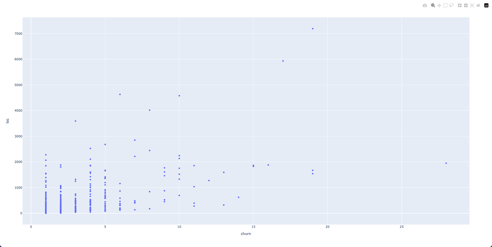

# Python hotspots

Simple scripts to compute hotspots in a python codebase 

# How to use

Copy `make_measures.sh` and `render_hotspots.py` at the root of your project.

Run these commands
```shell
sh make_measures.sh

pip install pandas
pip install plotly
python render_hotspots.py

open hotspots_with_loc.html
open hotspots_with_cyclomatic_complexity.html
```

You should get interactives plots, similar to this one:

